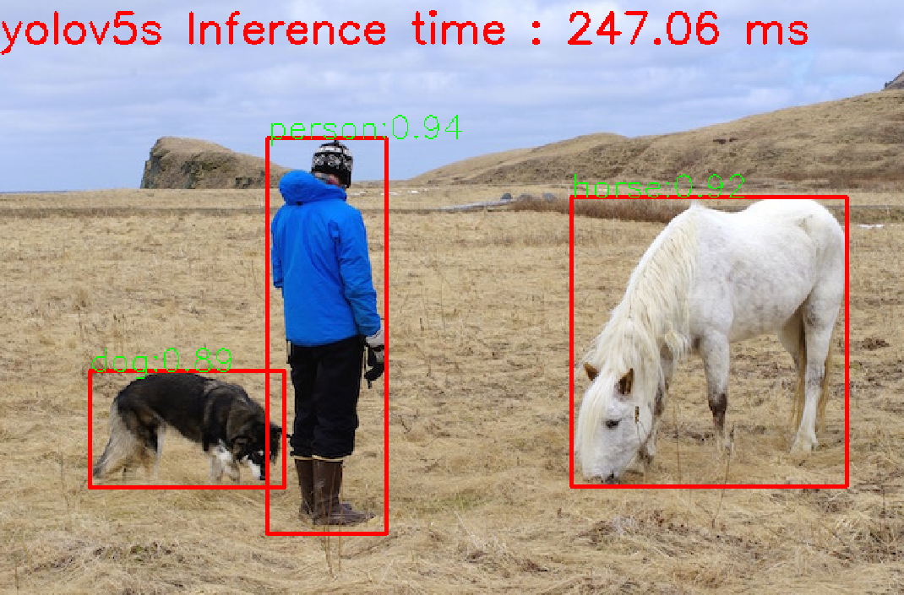
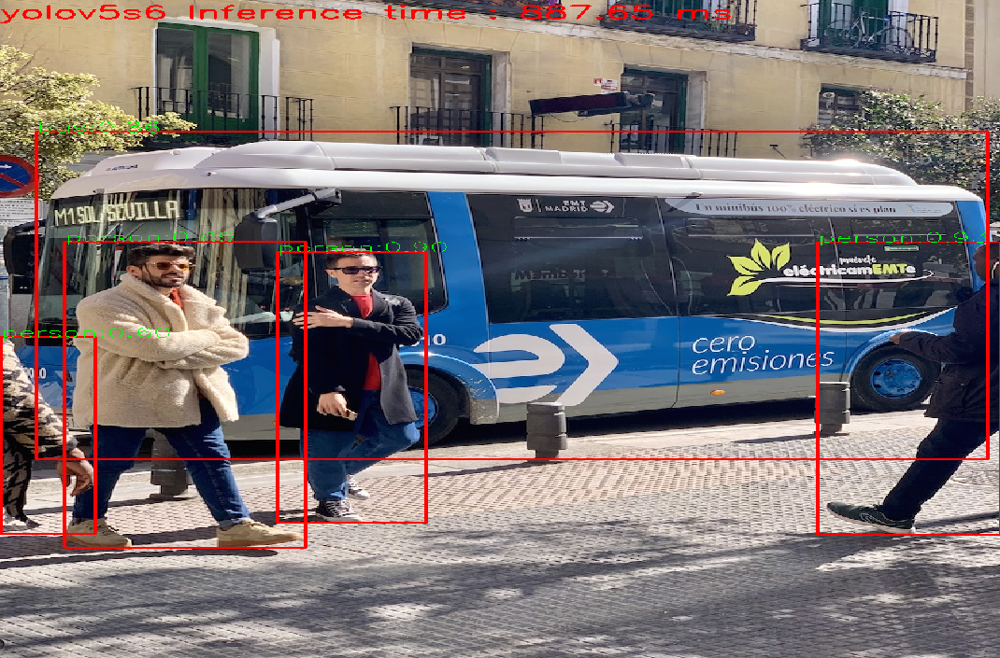

# Object detection deployment based on OpenCV(C++) 

*A python version is also provided*

## About

The yolo series is currently the most popular network for real-time target detection, but some deployment methods are complicated and overly dependent. The goal of this project is to provide a minimalist and efficient deployment method (relying only on opencv).

## Step

1. Install dependencies

   OpenCV

2. run main.cpp

   Currently supports yolov3/yolov4/Yolo-Fastest/YOLObile/yolov5

Note: 
- The yolov3/yolov4/Yolo-Fastest/YOLObile model is based on the darknet framework.
- The model file of yolov5 is a .onnx file converted from a .pt file in the pytorch framework.

## Result

